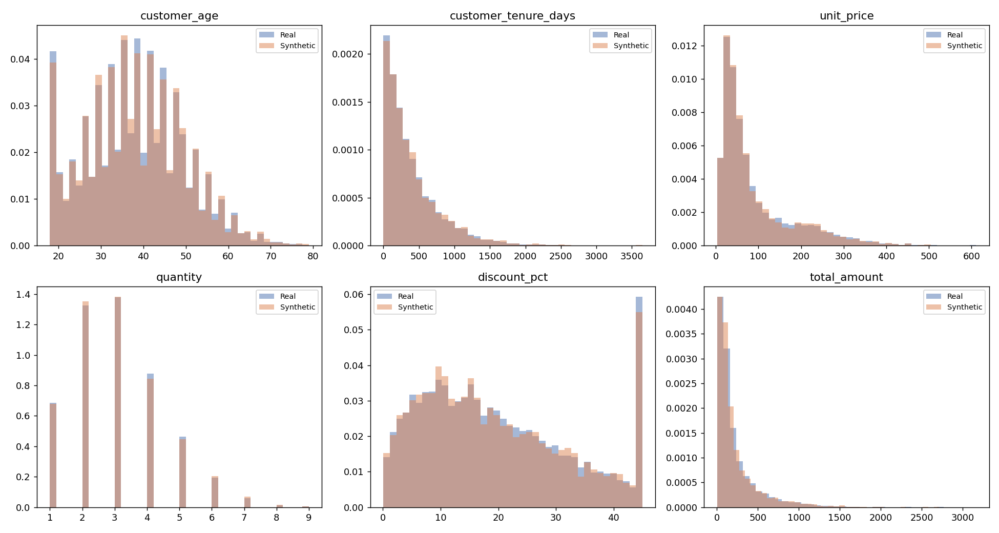
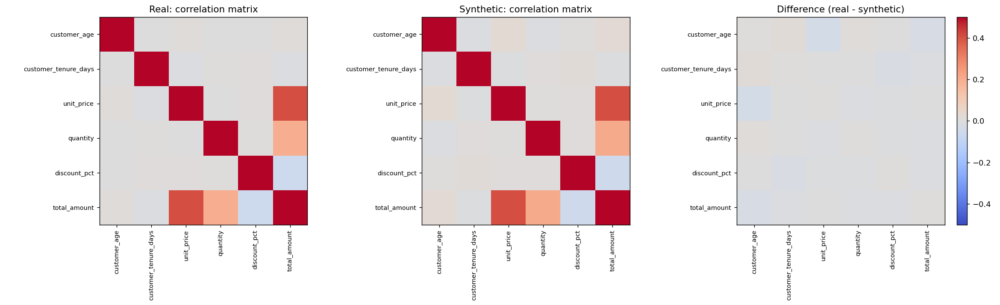

# synthetic-transaction-data

A pipeline that generates statistically realistic **synthetic e-commerce
transaction data** from a real (sensitive) dataset, so that models can be
prototyped and shared without exposing PII.

## Why this exists

Real transaction data is increasingly locked down by privacy law and
internal data-sharing policy. This pipeline lets analytics/ML work
continue on data that:
- preserves each column's real statistical distribution (age, price,
  discount, etc.)
- preserves the correlations between columns (e.g. `total_amount` moving
  with `unit_price` × `quantity`, fraud risk rising with transaction size)
- contains **no real customer records** — every synthetic row is newly
  sampled, not copied or perturbed from a real one

## How it works — Gaussian Copula synthesis

1. **Learn marginals**: each column's real-world distribution is captured
   via its empirical CDF (numeric) or category frequencies (categorical).
2. **Move to copula space**: every value is mapped through its distribution
   into standard-normal ("latent") space, where linear correlation is
   well-defined across mixed data types.
3. **Learn the correlation matrix** of that latent space — this is the
   entire "model": a handful of per-column distribution parameters plus
   one correlation matrix. No individual record is stored.
4. **Sample**: draw new points from a multivariate normal with that
   correlation matrix, then map each dimension back through its column's
   distribution to produce a brand-new, realistic row.

This is the same modeling family behind SDV's `GaussianCopulaSynthesizer`.
It was implemented from scratch (`src/synthesizer.py`, NumPy/SciPy only)
because this environment has no internet access to `pip install sdv` /
`ctgan` (which also requires `torch`). See the docstring at the top of
`main.py` for the exact 5-line swap to plug in real SDV/CTGAN on a machine
that does have internet access — the rest of the pipeline (loading,
validation, reporting) needs no changes either way.

## Project structure

```
synthetic_data_project/
├── main.py                     # orchestrates the full pipeline
├── src/
│   ├── generate_seed_data.py   # simulates the "real" source dataset
│   ├── synthesizer.py          # Gaussian Copula synthesizer
│   └── validate.py             # KS-test / TVD / correlation validation
├── data/
│   └── real_transactions.csv   # source data (replace with your real data)
└── outputs/
    ├── synthetic_transactions.csv
    ├── validation_report.md
    ├── distribution_comparison.png
    └── correlation_comparison.png
```

## Run it

```bash
python3 main.py
```

To use your own data instead of the simulated seed set, just drop your
CSV at `data/real_transactions.csv` (or point `main.py` at your file) —
the rest of the pipeline works unchanged.

## Validation methodology

| Check | Method | What it tells you |
|---|---|---|
| Numeric distribution match | Kolmogorov–Smirnov test per column | How close the synthetic column's distribution is to the real one |
| Categorical distribution match | Total variation distance | How close category frequencies are |
| Relationship structure | Correlation matrix comparison (Frobenius norm) | Whether relationships between columns (e.g. price ↔ total) survived |
| Privacy / leakage check | Exact-row match count between real and synthetic | Confirms no real record was memorized or replayed |

## Results on the included dataset (8,000 transactions, 12 columns)

- **Overall statistical similarity: 99.2%**
- 0 exact-row matches between real and synthetic data
- Full breakdown in [`outputs/validation_report.md`](outputs/validation_report.md)



